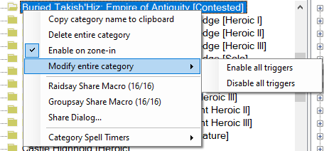
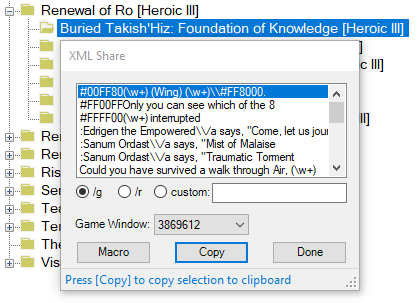

# Overview
This plugin organizes Custom Triggers into a panel of categories and a panel of triggers in the selected category. This is simply a different view of exactly the same triggers that are listed in the Custom Triggers tab. 

It is available from ACT's __Plugin Listing__ tab __[Get Plugins]__ button, _(80) TriggerTree_.

Below is a screenshot of the panels.

Features that are similar to the Custom Triggers tab:
* Green is used to show active triggers. A green category indicates that the category contains active triggers. (A green collapsed category group indicates that at least one category in the group contains active triggers).
* The checkbox next to the regular expression in the trigger pane enables / disables the trigger.
* Right-click context menus are available in the category and trigger panes.

Additional features of the plugin:
* When entering a zone in game, if there is a Category that matches the zone name, that Category is automatically selected.
* The __Find__ boxes at the top of the Category and Trigger panes provide incremental searches.
* Categories can be grouped into a user-defined folder, for instance to put all categories/zones from a particular game expansion into a single folder, as shown in the above screenshot.

### Version 1.7.2 Changes:
* Fix [Results Tab pop-up](#results-tabs) to work with ACT version 3.8.1 Release 284.

## Category Pane
The Category pane organizes triggers using the _Category_ field in the triggers themselves and a user-defined parent folder. In the example above, the parent folders use the name of the game expansion to bring trigger categories from that expansion together.

Similar to ACT, a trigger category is green if triggers in that category are active. If the parent folder for a green category is collapsed, the parent folder is green, for example the ` Default Group` shown above has one or more green categories as children.

The ` Default Group` (notice the leading space so it sorts at the top) collects triggers that the user has not assigned a parent folder, for example triggers shared outside of TriggerTree. Also, the first time TriggerTree version 1.7 runs, it puts all existing trigger categories in the ` Default Group`.

Create a new parent folder by clicking the [+] button at the top of the category pane. Folder names can be just about anything the user desires, though duplicates are not allowed.

Categories may be moved between group folders using drag and drop or the [edit trigger](#edit-all-fields) dialog.

### Category Menus

#### Category Group
The top level parent folders in the category pane are referred to here as the _Category Group_. 

A right-click on a parent folder brings up the group context menu as shown below:

The _Delete Category Group_ removes the group and moves all of its trigger categories to the ` Default Group`.

The [share menus](#sharing-menus) will share everything in every category under the group, in this case 82 triggers and timers. It is best if the receiving player has the sending player on their whitelist so those shares don't get backed up in a queue, since the receiver will probably not be able to manually accept 82 shares before the pop-up dialogs time out. (In case of a backup, the shares can be accepted on ACT's __Options__ tab, _XML Share Snippets_ panel, in the yellow box.)

To share the _Category Group_, the sender must use the __Share Dialog...__ or the 'macro' menus in either the Category or Triggers pane. The 'Copy XML' sharing menus in the Trigger pane use the original ACT format that does not contain the _Category Group_.

When receiving a shared trigger, the _Category Group_ is handled as follows:
* If shared from ACT or a 'Copy XML' menu, and the receiver does not already have the _Category / Zone_ in a group, the category goes into ` Default Group`
* If the receiver does not already have triggers in the _Category / Zone_, the category is placed in the sender's group (which is created if required).
* If the receiver already has triggers in the _Category / Zone_ but the category is in ` Default Group` and the sender has it in a different group, the category is placed in the sender's group (which is created if required).
* If the reciever already has triggers in the _Category / Zone_ in a group other than ` Default Group`, the category stays in the receiver's original group.

#### Trigger's Category Subfolders
The subfolder of the _Category Group_ contains the categories retreived from the actual triggers. (On the ACT __Custom Triggers__ tab, these are the top level items.)

 A right-click on a category brings up the category context menu as shown below:

The first section of this menu affects the category itself.

The _Delete entire category_ choice will delete all the triggers in the category and the category itself.

The _Enable on zone-in_ choice provides a work-around for EQII [color coded zone names](#color-coded-zone-name).

The _Modify entire category_ opens a sub menu that controls enabling or disabling all of the triggers in the category.

The _Enable all triggers_ is equivalent to checking ACT's _Custom Triggers_ category level checkbox.

The _Disable all triggers_ is equivalent to un-checking ACT's _Custom Triggers_ category level checkbox.

The second and third sections of the category context menu are related to [sharing](#sharing-menus). These menus also share the _Category Group_ folder as described [above](#category-group).

The _Category Spell Timers_ sub-menu provides a list of timers that are started by a trigger in the category or have the category name in their _Custom Tooltip_ field.

#### Color-coded Zone Name
The addition of a color-code on EQII zone names, e.g. __\\#00FF00Buried Takish'Hiz: Empire of Antiquity [Contested] 3__, complicates trigger sharing since EQII strips out the color code when pasting it into a chat window. So sharing a trigger with that zone name ends up changing the category name for the player receiving the trigger to __Buried Takish'Hiz: Empire of Antiquity [Contested] 3__. If the _Restrict to Category / Zone_ checkbox is checked, the trigger will not work for the recipient.

The plugin provides a work-around.
* Create a category that does not include the color code or the instance number, e.g. __Buried Takish'Hiz: Empire of Antiquity [Contested]__
* Check the _Enable on zone-in_ menu.
* Add triggers appropriate for the color coded zone.

When checked, the _Enable on zone-in_ provides for the following:
* Triggers can be collected under a category that does not contain either the color code or the instance number.
* The plugin automatically enables and disables the triggers by modifying the _Restrict to Category / Zone_ setting when entering or leaving any instance that matches just the category name without a prefix color code or postfix instance number.
* Pressing the __[Category/Zone]__ button in the [Edit All Fields](#edit-all-fields) dialog enters the category name without the color code or instance number.
* Shared triggers work for other users of the plugin if they also enable this setting. 
  * Players not using the plugin are best served when the plugin user shares the triggers while they are green (i.e. you are in the zone and the triggers are not restricted). The other player can then easily enable or disable the category using the category checkbox in ACT's _Custom Triggers_ tab.

In the example above, when entering a zone that EQII identifies as __\\#00FF00Buried Takish'Hiz: Empire of Antiquity [Contested] 3__, the plugin ignores the __\\#00FF00__ and the __3__, matches the resulting category name and enables all of the triggers by unchecking their _Restrict to Category / Zone_ checkbox.

The example above effectively replaces having copies of triggers in three (or more) different categories
* __\\#00FF00Buried Takish'Hiz: Empire of Antiquity [Contested]__
* __\\#00FF00Buried Takish'Hiz: Empire of Antiquity [Contested] 2__
* __\\#00FF00Buried Takish'Hiz: Empire of Antiquity [Contested] 3__

 with their _Restrict to Category / Zone_ checkbox checked. Except that color coded triggers cannot be properly shared.

### Sharing Menus
The sharing section of the category context menus is mostly related to sharing data via EQII macros, though the [Share Dialog](#share-dialog) can also be used to paste data into a chat box. Macros are discussed in the [EQII Macros](#share-via-eqii-macros) section. (The numbers in parentheses are how many of the total items can be shared in a macro.)

To build the _Category Spell Timers_ menu, the plugin searches for spell timers
* referenced in the category's triggers
* or whose __Category__ matches the clicked category name
* or whose __Custom Tooltip__ contains the category name

The spell timer tooltip can contain multiple potential matches when separated by the `|` character sequence (space-bar-space). For example, to set up a timer so that it is in the list for both normal and challenge zones, the tooltip can be set to `Vex Thal: Beyond the Veil [Raid] | Vex Thal: Beyond the Veil [Challenge Raid]`. That spell timer will show up in the context menu for both categories. Note that a long tooltip can encroach on the maximum paste length in EQII.

To simply share a spell timer via XML copy/paste in EQII chat, right click the spell timer name in the _Category Spell Timers_ sub-menu.

Left-click the spell timer name to open ACT's __Spell Timers (Options)__ window with a search for that timer name.

#### Share Dialog
The __Share Dialog...__ menu opens a dialog that can speed up sharing of triggers and timers. And with alternate encoding enabled via the  button on the Triggers pane toolbar, triggers and timers that otherwise [could not go into an EQII macro](#share-via-eqii-macros), will go into a macro.

If an EQII game window is found, the dialog initially opens with the __[Macro]__ items listed. Otherwise, the dialog initially opens with the __[Copy]__ items listed. The list can be switched between __[Copy]__ items and __[Macro]__ items by pressing the respective button.

An example usage where alternate encoding is disabled and the zone name contains an apostrophe which restricts macros is shown below for both the [Macro] and [Copy] modes. The macro dialog header shows that only the timers can go in a macro (due to the apostrophe in the zone name).

 

The __[Copy]__ dialog contains a list of all of the regular expressions for the category's enabled triggers, and the names of the category's spell timers. Pressing the __[Copy]__ button copies the XML for the selected item to the clipboard. For subsequent __[Copy]__ button presses, the next item is automatically selected, then copied. The prefix selected by the radio buttons provides the command to paste the XML into the group, raid, or custom chat channel.

When the __[Macro]__ button is activated with the alternate encoding enabled via the Trigger pane button , the plugin can put all triggers and spell timers in macros, including those with [problem characters](#share-via-eqii-macros). ACT alone will not recognize the alternate encoding scheme and __any recipients must be running TriggerTree plugin version 1.6 or newer to successfully receive the data__. An example of the share dialog with alternate encoding enabled is shown below:

If the plugin finds any running Everquest2 game(s), the __Game Window:__ list contains those window handle(s). If the __Game Window:__ selection is not blank, pressing the __[Copy]__ or __[Macro]__ button will also activate the selected game window. Once the game window is activated, the chat box can be activated by pressing the `Enter` key. (`Enter` is the default key binding. Use whatever key is set in _Options->Controls->Chat Keys->Begin Chat_.) The user can then press `Ctrl-v` to paste and `Enter` to complete the command.

With a game window selected in the list, the user sequence to paste the list into the game becomes:
1. Click the __[Copy]__ or __[Macro]__ button.
2. Press the `Enter` key to select the chat box in EQII.
3. Press the `Ctrl-v` key combination to paste the item into the chat window.
4. Press the `Enter` key to finish the command.
5. Repeat from Step 1 for the remaining items.

A keyboard-only sequence is available from Step 5 using `Alt-Tab` and `Alt-m`, `Alt-c`, and `Alt-d`, as follows:
* after Step 4 above, press `Alt-Tab` to return focus to the share dialog.
* then press `Alt-m` to "press" the __[Macro]__ button (or `Alt-c` to "press" the __[Copy]__ button, or `Alt-d` to "press" the __[Done]__ button).
* the appropriate line is copied to the clipboard and the game window is activated.
* continue at Step 2 above.

The __[Macro]__ button provides a quick way to activate the macro file(s) in the game chat window using the same process described above. The button is disabled if none of the items can go in a macro. An example macro file list is shown below:

## Trigger Pane
All triggers for the selected category are shown in the Trigger pane.

Trigger details are available by clicking the + next to the regular expression.  A context menu is provided via a right-click on a trigger, as shown below.

Double-click the __Alert:__ or __Timer or Tab name__ sub-items to edit just those fields.

When there is a spell timer:
* A search for the spell timer in ACT's __Spell Timers (Options)__ window can be initiated via
	* double-clicking or right-clicking the __Trigger Timer__ line in the trigger pane,
	* pressing the __[Find]__ button in the __Timer or Tab name__ edit dialog,
	* or pressing the magnifying glass button  next to the __Trigger Timer__ checkbox in the [trigger edit dialog](#edit-all-fields).
* The spell timer XML can be copied for sharing by right-clicking the __Timer or Tab name__ in the trigger pane and choosing the appropriate menu choice.

### Edit All Fields
To edit all of the trigger fields, double-click the regular expression.
To create a new trigger, right-click in a blank area in the trigger pane or press the [+] button on the Trigger pane toolbar. Either action will open the Edit Trigger dialog.

Features of the edit trigger dialog:
* If the _Regular Expression_ or _Category / Zone_ fields are changed, the dialog allows either replacing the original trigger or creating a new trigger. Editing other fields updates the existing trigger.
* The paste clipboard button  at the end of the regular expression will recognize a log line copied from ACT's View Logs list and reformat the line to be a valid Regular Expression.
* While typing in the Regular Expression box, the text turns red if the expression is invalid.
* Selecting text in the Regular Expression and right-clicking provides a context menu that can replace the selection with a capture group as shown below:

	

* Capture groups in the __Regular Expression__ are automatically added to the drop down list next to the TTS button. They may be inserted into the TTS expression via the insert button  to the right of the drop down. 
	* Note that named capture groups such as `(?<player>\w+)` cannot be saved to an EQII macro (due to the brackets) unless the alternate encoding button  is active on the Trigger pane toolbar.

### Edit Category Group
The __Category Group__ is the user-defined top level folder in the Category pane where the trigger __Category / Zone__ resides.

The drop list will show all currently defined groups. To create a new group, edit the text box.

If an existing trigger's __Category Group__ is changed, that entire category and all its triggers will be moved to the specified group. (This has the same effect as dragging the category from one group to another in the category pane.)

### Results Tabs
When the trigger's __Add Results tab__ checkbox is checked, ACT adds a tab next to the __Triggers__ tab under the __Custom Triggers__ tab. The tab is named using the __Timer / Tab Name__ and lists data from log lines that match the trigger.

When the Trigger pane results tab button  is pressed, the plugin will generate another view of the results tabs upon the occurrance of a trigger with a checked _Add Results tab_. The plugin's view is a popup stay-on-top window. Instead of tabs, the plugin stacks the trigger data in a single view. A demonstration with 2 tabs is shown below:

Items are added such that the newest one is at the top of the list of each tab. Tabs are ordered in the window such that the newest occurring tab or tab item is at the top.

The plugin just provides another view of the data collected by ACT. To clear a tab and remove it from the stack, it must be cleared in ACT with the appropriate tab's __[Clear Items]__ button.

Closing the plugin's window also does not clear the data. When a new trigger occurs, the window will re-open showing both the old and new items.

Pressing the red __[X]__ button on a tab will hide (actually, just not draw) any items with a Time Stamp older than the time when the button is pressed. The tab itself remains visible. The items are actually still in the list since they are still in ACT's list, so a scroll bar may show up when it looks unnecessary. Un-pressing the button will show all items again. A pressed button has the  blue-ish background, like the bottom tab in the example above. Note that this button may not work as expected since ACT only stores the log line time and not the date. Any entries from a different date (like playing through midnight or importing an old log file) may not clear. Use ACT's __[Clear Items]__ instead.

There is a minor difference between re-enabling a Results Tab using ACT's Custom Triggers tab __[Add/Edit]__ button versus checking the checkbox in the plugin. In the plugin, if a previously disabled tab is re-enabled by checking the checkbox, any items that were present when the checkbox was unchecked are restored when it is re-checked. In ACT, re-enabling a disabled Results Tab creates a new empty tab.

### Show Encounters
The [Edit All screenshot](#edit-all-fields) above also has the __Show Encounters__ checkbox checked.
* When the __Show Encounters__ checkbox is checked, the dialog expands to show a list of encounters on the left. Selecting an encounter displays a list of log lines for that encounter.
* To help find a potential trigger line, the log lines can be filtered by entering text in the __Filter:__ area.  The screenshot example has a filter of '\\#', which shows lines with a color code.
* Check the __By Regex__ box to only show log lines that match the regular expression. 
* The context menu for a log line allows the following:
	* Pasting it into the __Regular Expression__ text box after formatting it as a valid regular expression.
	* Testing it against the __Regular Expression__. When testing, any capture groups are appropriately replaced in a TTS expression and the spell timer (if set) is triggered.
	* Creating a spell timer from the [time difference](#show-time-differences) between matching log lines.

### Show Time Differences
The _Show Time Differences_ context menu assists in creating an ACT spell timer from non-damage log lines. The conceptual example below is the result of selecting _Show Time Differences_ given the filter `unleash a barrage`.

Pressing the __[Make Timer]__ button creates a spell timer using the data on the right hand side and opens ACT's __Spell Timers (Options)__ window with a search for that timer.

## Share via EQII Macros
EQII macros won't handle certain characters and character sequences. 
* The problem characters are:
    > ' " ; < >
* The problem character sequence is:
  > \\#

If sharing with players that do not use the TriggerTree plugin, these problem characters must be avoided. When sharing with TriggerTree users, all of the following problems can be avoided by pressing the alternate encoding button  in the Trigger panel toolbar if all users are using TriggerTree.

The Trigger pane shows which triggers and spell timers can be shared via macro by displaying the 'macro play' icon 
next to the checkbox for the regular expression and timer name. Triggers and timers that cannot go in a macro are missing the 'macro play' icon.

When editing a trigger, the problem fields are indicated by the red circled 'macro play' icon, as shown below:

### Macro Workarounds
The easiest work-around is for all players to use version 1.6 or newer of the TriggerTree plugin and enable the alternate encoding button  on the Trigger panel toolbar. The alternate encoding will allow all characters to be shared in a macro.

If alternate encoding is not possible, the following paragraphs describe some other possible work-arounds in ACT encoded macros.

In the cases where the zone name contains an apostrophe, there's not much recourse. It can't be shared in an ACT encoded macro.

But in many cases, it is possible to work around the problem characters by changing the trigger.
* If the trigger __Regular Expression__ contains prohibited characters, it can often be rewritten to remove those characters. In many cases the offending characters can just be removed from the beginning or end of the trigger without affecting its usefulness. Example alternate approaches for when that's not feasable include:
	* `Praetorian K'Tikrn gets sick` 
      * replace the apostrophe with a wild card period, becoming 
        * `Praetorian K.Tikrn gets sick`
	* `prepares to unleash a mighty barrage in (?<player>\w+)`
      * replace the named capture group with a numbered capture group, becoming
        * `prepares to unleash a mighty barrage in (\w+)`
    * `You have infected your enemies with \\#FF0000Dark Incubation!`
      * replace the `\\` with a wild card period, becoming
        * `You have infected your enemies with .#FF0000Dark Incubation!`
    * `\\#FF9900You feel energized by Crystalline Destruction`
      * just remove the slashes, becoming
        * `#FF9900You feel energized by Crystalline Destruction`
    * `says, "Bring on the rocks`
      * replace the double quote with a wild card period, becoming
        * `says, .Bring on the rocks`
* If the trigger __Alert__ or __Timer or Tab name__ contain prohibited characters, they can often be written differently to exclude those characters.
* If the timer name, sounds, or tool tip contain prohibited characters, they can often be written differently to exclude those characters.

Note that if the spell timer __Category__ contains prohibited characters, changing it may break functionality if the __Restrict to category zone or mob__ checkbox is checked.

The __Category__ context menu for spell timers searches for timers with a matching __Category__ or __Custom Tooltip__. When the __Custom Tooltip__ property is used to provide a match, any apostrophes in the category name may be replaced with a period and the match will still succeed. For example, a __Custom Tooltip__ of `Ssraeshza's Hallowed Halls [Raid]` can be replaced with `Ssraeshza.s Hallowed Halls [Raid]` and the spell timer will be added to the Category context menu for `Ssraeshza's Hallowed Halls [Raid]`. This would allow the spell timer to be written to a macro.

### Share Menus
With macro-valid triggers or timers, a context menu selection of the _Raidsay Share Macro_ or _Groupsay Share Macro_ menu will create a macro to share all available and enabled triggers and spell timers. Then in an EQII chat window enter `/do_file_commands triggers.txt` to share everything with the raid. Any invalid items are simply left out of the macro file.

The _Share Dialog_ context menu provides a [dialog](#share-dialog) for sharing via both macros and copy/paste.

EQII macros are limited to 16 lines. When sharing more than 16 items, multiple files are created. Items 1-16 are in file `triggers.txt`. Items 17-32 are in file `triggers1.txt`, etc.  The __Notifications__ tab in ACT lists which file(s) were used.

# Building the plugin from source
For ease of maintenance, the Visual Studio project consists of several separate c-sharp source files.  ACT wants a single file for run-time-compiled plugins. The Visual Studio build process included in the project builds a DLL, then runs the `merge_sources.py` python script to merge the separate source files into a single source file. For development, debug, and testing, the DLL can be added to ACT as a plugin.  But it is the combined source file in the `single_source` folder that is released and distributed via the __[Get Plugins..]__ button and the update process in ACT.