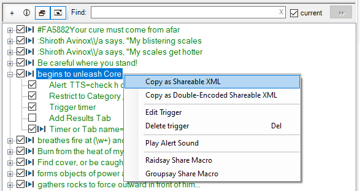

# Overview
This plugin organizes Custom Triggers into a panel of categories and a panel of triggers in the selected category. This is simply a different view of exactly the same triggers that are listed in the Custom Triggers tab.

Below is a screenshot of the panels.

Features that are similar to the Custom Triggers tab:
* Green is used to show active triggers. A green category indicates that the category contains active triggers.
* The checkbox next to the regular expression in the trigger pane enables / disables the trigger.
* Right-click context menus are available in the category and trigger panes.

Additional features of the plugin:
* When entering a zone in game, if there is a Category that matches the zone name, that Category is automatically selected.
* The __Find__ boxes at the top of the Category and Trigger panes provide incremental searches.

### Version 1.5.0 Changes:
* Rework handling of Custom Triggers Results Tabs checkboxes for better coordination with ACT.
* Added a [category context menu](#category-pane) to enable / disable all triggers in the category.
* Added two buttons at the top left of the triggers panel:
  * The "plus" button provides an alternate way to open the [edit trigger dialog](#edit-all-fields) for a new trigger.
  * The "windows" button enables a popup [alternate view of the "Results Tabs"](#results-tab) of ACT's Custom Triggers.

## Editing Triggers
Trigger details are available by clicking the + next to the trigger.  A context menu is provided via a right-click on a trigger, as shown below.

Double-click the __Alert:__ or __Timer or Tab name__ to edit just those fields.

When there is a spell timer:
* A search for the spell timer in ACT's __Spell Timers (Options)__ window can be initiated via
	* double-clicking or right-clicking the __Trigger Timer__ line in the trigger pane,
	* pressing the __[Find]__ button in the __Timer or Tab name__ edit dialog,
	* or pressing the magnifying glass button next to the __Trigger Timer__ checkbox in the trigger edit dialog.
* The spell timer XML can be copied for sharing by right-clicking the __Timer or Tab name__ in the trigger pane and choosing the appropriate menu choice.

### Edit All Fields
To edit all of the trigger fields, double-click the regular expression.
To create a new trigger, right-click in a blank area in the trigger pane or press the [+] button on the trigger pane toolbar.

Features of the edit trigger dialog:
* If the Regular Expression or Category / Zone fields are changed, the dialog allows either replacing the original trigger or creating a new trigger. Editing other fields updates the existing trigger.
* The paste clipboard button will recognize a log line copied from ACT's View Logs list and reformat the line to be a valid Regular Expression.
* While typing in the Regular Expression box, the text turns red if the expression is invalid.
* Selecting text in the Regular Expression and right-clicking provides a context menu that can replace the selection with a capture group.

	

* Capture groups in the __Regular Expression__ are automatically added to the drop down list next to the TTS button (e,g, the 1 shown in the [Edit All screenshot](#edit-all-fields) which represents the __(\d+)__ in the expression). They may be inserted into the TTS expression via the insert button to the right of the drop down. 
	* Note that named capture groups such as `(?<player>\w+)` cannot be saved to an EQII macro due to the brackets.

### Results Tabs
When the trigger's __Add Results tab__ checkbox is checked, ACT adds a tab next to the __Triggers__ tab. The tab is named using the __Timer / Tab Name__ and lists data from log lines that match the trigger.

When the  button in the plugin's triggers pane is pressed, the plugin will generate another view of the results tabs upon the occurrance of a trigger with a checked _Add Results tab_. The plugin's view is a popup stay-on-top window. Instead of tabs, the plugin stacks the trigger data in a single view. A demonstration with 2 tabs is shown below:

Items are added such that the newest one is at the top of the list of each tab. Tabs are ordered in the window such that the newest occurring tab or tab item is at the top.

The plugin just provides another view of the data collected by ACT. To clear a tab and remove it from the stack, it must be cleared in ACT with the appropriate tab's [Clear Items] button.

Closing the plugin's window also does not clear the data. When a new trigger occurs, the window will re-open showing both the old and new items.

Pressing the red X button on a tab will hide (actually, just not draw) any items with a Time Stamp older than the time when the button is pressed. The tab itself remains visible. The items are actually still in the list since they are still in ACT's list, so a scroll bar may show up when it looks unnecessary. Un-pressing the button will show all items again. A pressed button has the  blue-ish background, like the bottom tab in the example above.

There is a minor difference between re-enabling a Results Tab using ACT's Custom Triggers tab [Add/Edit] button versus checking the checkbox in the plugin. In the plugin, if a previously disabled tab is re-enabled by checking the checkbox, any items that were present when the checkbox was unchecked are restored when it is re-checked. In ACT, re-enabling a disabled Results Tab creates a new empty tab.

### Show Encounters
The [Edit All screenshot](#edit-all-fields) above also has the __Show Encounters__ checkbox checked.
* When the __Show Encounters__ checkbox is checked, the dialog expands to show a list of encounters on the left. Selecting an encounter displays a list of log lines for that encounter.
* To help find a potential trigger line, the log lines can be filtered by entering text in the __Filter:__ area.  The screenshot example has a filter of '#', which shows lines with a color code.
* Check the __By Regex__ box to only show log lines that match the regular expression. 
* The context menu for a log line allows the following:
	* Pasting it into the __Regular Expression__ text box after formatting it as a valid regular expression.
	* Testing it against the __Regular Expression__. When testing, any capture groups are appropriately replaced in a TTS expression and the spell timer (if set) is triggered.
	* Creating a spell timer from the [time difference](#show-time-differences) between matching log lines.

### Show Time Differences
The _Show Time Differences_ context menu assists in creating an ACT spell timer from non-damage log lines. The conceptual example below is the result of selecting _Show Time Differences_ given the filter `unleash a barrage`.

Pressing the __[Make Timer]__ button creates a spell timer using the data on the right hand side and opens ACT's __Spell Timers (Options)__ window with a search for that timer.

## Category Pane
A right-click on a category brings up the category context menu as shown below:

The _Disable all category triggers_ choice is presented if all of the triggers in the selected category are currently enabled. If any of the triggers in the selected category are currently disabled, the menu choice becomes _Enable all category triggers_.

The second section of this menu is related to sharing data via EQII macros. Macros are disussed in the [EQII Macros](#share-via-eqii-macros) section. (The numbers in parentheses are how many of the total items can be shared in a macro.)

To build the _Category Spell Timers_ menu, the plugin searches for spell timers whose __Category__ matches the clicked category name or whose __Custom Tooltip__ contains the category name.

The tooltip can contain multiple potential matches when separated by the `|` character. For example, to set up a timer so that it is in the list for both normal and challenge zones, the tooltip can be set to `Vex Thal: Beyond the Veil [Raid] | Vex Thal: Beyond the Veil [Challenge Raid]`. That spell timer will show up in the context menu for both categories. Note that a long tooltip can encroach on the maximum paste length in EQII.

To simply share a spell timer via XML copy/paste in EQII chat, right click the spell timer name.

Left-click the spell timer name to open ACT's __Spell Timers (Options)__ window with a search for that timer name.

### Share Dialog
The __Share Dialog...__ menu opens a dialog that can speed up sharing of triggers and timers, especially when macros don't work.

If an EQII game window is found, the dialog initially opens with the __[Macro]__ items listed. Otherwise, the dialog initially opens with the __[Copy]__ items listed. The list can be switched between __[Copy]__ items and __[Macro]__ items by pressing the respective button.

An example usage where the zone name prevents macros is shown below:

The dialog contains a list of all of the regular expressions for the category's enabled triggers, and the names of the category's spell timers. Pressing the __[Copy]__ button copies the XML for the selected item to the clipboard. For subsequent __[Copy]__ button presses, the next item is automatically selected, then copied. The prefix selected by the radio buttons provides the command to paste the XML into the group, raid, or custom chat channel.

If the plugin finds any running Everquest2 game(s), the __Game Window:__ list contains those window handle(s). If the __Game Window:__ selection is not blank, pressing the __[Copy]__ or __[Macro]__ button will also activate the selected game window. Once the game window is activated, the chat box can be activated by pressing the `Enter` key. (`Enter` is the default key binding. Use whatever key is set in _Options->Controls->Chat Keys->Begin Chat_.) The user can then press `Ctrl-v` to paste and `Enter` to complete the command.

With a game window selected, the user sequence to paste the list into the game becomes:
1. Click the __[Copy]__ or __[Macro]__ button.
2. Press the `Enter` key to select the chat box in EQII.
3. Press the `Ctrl-v` key combination to paste the item into the chat window.
4. Press the `Enter` key to finish the command.
5. Repeat from Step 1 for the remaining items.

The __[Macro]__ button provides a quick way to activate the macro file(s) in the game chat window using the same process described above. The button is disabled if none of the items can go in a macro. An example macro file list is shown below:

## Share via EQII Macros
Ideally, it would be possible to make a macro containing all of the zone's triggers and spell timers for sharing with the group (or raid) in a single step. 

Unfortunately this won't always work since macros won't handle certain characters and character sequences. 
* The problem characters are:
    > ' " ; < >
* The problem character sequence is:
  > \\#

The trigger pane shows which triggers and spell timers can be shared via macro by displaying the 'macro play' icon 
next to the checkbox for the regular expression and timer name. 
In the [Category](#category-pane) screenshot above, all of the spell timers can go in a macro except ones that contain an apostrophe. Therefore those timers lack the 'macro play' icon.

When editing a trigger, the problem fields are indicated by the red circled 'macro play' icon, as shown below:

### Macro Workarounds
In the cases where the zone name contains an apostrophe, there's not much recourse. It can't be shared in a macro.

But in many cases, it is possible to work around the problem characters by changing the trigger.
* If the trigger __Regular Expression__ contains prohibited characters, it can often be rewritten to remove those characters. In many cases the offending characters can just be removed from the beginning or end of the trigger without affecting its usefulness. Example alternate approaches for when that's not feasable include:
	* `Praetorian K'Tikrn gets sick` 
      * replace the apostrophe with a wild card period, becoming 
        * `Praetorian K.Tikrn gets sick`
	* `prepares to unleash a mighty barrage in (?<player>\w+)`
      * replace the named capture group with a numbered capture group, becoming
        * `prepares to unleash a mighty barrage in (\w+)`
    * `You have infected your enemies with \\#FF0000Dark Incubation!`
      * replace the `\\` with a wild card period, becoming
        * `You have infected your enemies with .#FF0000Dark Incubation!`
    * `\\#FF9900You feel energized by Crystalline Destruction`
      * just remove the slashes, becoming
        * `#FF9900You feel energized by Crystalline Destruction`
    * `says, "Bring on the rocks`
      * replace the double quote with a wild card period, becoming
        * `says, .Bring on the rocks`
* If the trigger __Alert__ or __Timer or Tab name__ contain prohibited characters, they can often be written differently to exclude those characters.
* If the timer name, sounds, or tool tip contain prohibited characters, they can often be written differently to exclude those characters.

Note that if the spell timer __Category__ contains prohibited characters, changing it may break functionality if the __Restrict to category zone or mob__ checkbox is checked.

The __Category__ context menu for spell timers searches for timers with a matching __Category__ or __Custom Tooltip__. When the __Custom Tooltip__ property is used to provide a match, any apostrophes in the category name may be replaced with a period and the match will still succeed. For example, a __Custom Tooltip__ of `Ssraeshza's Hallowed Halls [Raid]` can be replaced with `Ssraeshza.s Hallowed Halls [Raid]` and the spell timer will be added to the Category context menu for `Ssraeshza's Hallowed Halls [Raid]`. This would allow the spell timer to be written to a macro.

### Share Menus
With macro-valid triggers or timers, a context menu selection of the _Raidsay Share Macro_ or _Groupsay Share Macro_ menu will create a macro to share all available and enabled triggers and spell timers. Then in an EQII chat window enter `/do_file_commands triggers.txt` to share everything with the raid. Any invalid items are simply left out of the macro file.

EQII macros are limited to 16 lines. When sharing more than 16 items, multiple files are created. Items 1-16 are in file `triggers.txt`. Items 17-32 are in file `triggers1.txt`, etc.  The __Notifications__ tab in ACT lists which file(s) were used.

# Building the plugin from source
For ease of maintenance, the Visual Studio project consists of several separate c-sharp source files.  ACT wants a single file for run-time-compiled plugins. The Visual Studio build process included in the project builds a DLL, then runs the `merge_sources.py` python script to merge the separate source files into a single source file. For development, debug, and testing, the DLL can be added to ACT as a plugin.  But it is the combined source file in the `single_source` folder that is released and distributed via the __[Get Plugins..]__ button and the update process in ACT.