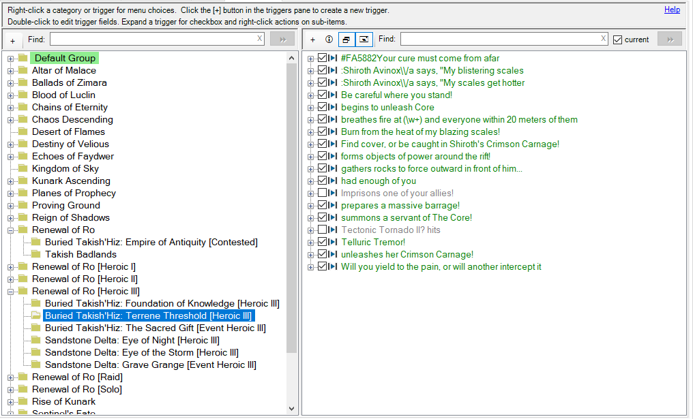
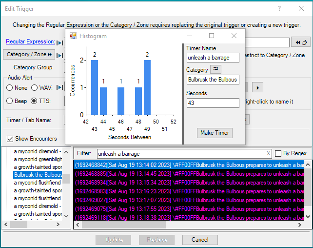

# Overview
This plugin organizes Custom Triggers into a panel of categories and a panel of triggers in the selected category. This is simply a different view of exactly the same triggers that are listed in the Custom Triggers tab.

Below is a screenshot of the panels.

Features that are similar to the Custom Triggers tab:
* Green is used to show active triggers. A green category indicates that the category contains active triggers.
* The checkbox next to the regular expression in the trigger pane enables / disables the trigger.
* Right-click context menus are available in the category and trigger panes.

Additional features of the plugin:
* When entering a zone in game, if there is a Category that matches the zone name, that Category is automatically selected.
* The __Find__ boxes at the top of the Category and Trigger panes provide incremental searches.

### Version 1.3.0 Changes:
* Added the __By Regex__ checkbox in [Show Encounters](#show-encounters) to list log lines that match the regular expression.
* [Show Encounters](#show-encounters) __Paste in Regular Expression__ now escapes ( ) and ?
* Moved the link-to-help from the context menu to the upper right corner.
* Some cosmetic changes.

## Editing Triggers
Trigger details are available by clicking the + next to the trigger.  A context menu is provided via a right-click on a trigger, as shown below.

Double-click the __Alert:__ or __Timer or Tab name__ to edit just those fields.

When there is a spell timer:
* A search for the spell timer in ACT's __Spell Timers (Options)__ window can be initiated via
	* double-clicking or right-clicking the __Trigger Timer__ line in the trigger pane,
	* pressing the __[Find]__ button in the __Timer or Tab name__ edit dialog,
	* or pressing the magnifying glass button next to the __Trigger Timer__ checkbox in the trigger edit dialog.
* The spell timer XML can be copied for sharing by right-clicking the __Timer or Tab name__ in the trigger pane and choosing the appropriate menu choice.

### Edit All Fields
To edit all of the trigger fields, double-click the regular expression.
To create a new trigger, right-click in a blank area in the trigger pane.

Features of the edit trigger dialog:
* If the Regular Expression or Category / Zone fields are changed, the dialog allows either replacing the original trigger or creating a new trigger. Editing other fields updates the existing trigger.
* The paste clipboard button will recognize a log line copied from ACT's View Logs list and reformat the line to be a valid Regular Expression.
* While typing in the Regular Expression box, the text turns red if the expression is invalid.
* Selecting text in the Regular Expression and right-clicking provides a context menu that can replace the selection with a capture group.

	

* Capture groups in the __Regular Expression__ are automatically added to the drop down list next to the TTS button (e,g, the 1 shown in the [Edit All screenshot](#edit-all-fields) which represents the __(\d+)__ in the expression). They may be inserted into the TTS expression via the insert button to the right of the drop down. 
	* Note that named capture groups such as `(?<player>\w+)` cannot be saved to an EQII macro due to the brackets.
	

### Show Encounters
The [Edit All screenshot](#edit-all-fields) above also has the __Show Encounters__ checkbox checked.
* When the __Show Encounters__ checkbox is checked, the dialog expands to show a list of encounters on the left. Selecting an encounter displays a list of log lines for that encounter.
* To help find a potential trigger line, the log lines can be filtered by entering text in the __Filter:__ area.  The screenshot example has a filter of '#', which shows lines with a color code.
* Check the __By Regex__ box to only show log lines that match the regular expression. 
* The context menu for a log line allows the following:
	* Pasting it into the __Regular Expression__ text box after formatting it as a valid regular expression.
	* Testing it against the __Regular Expression__. When testing, any capture groups are appropriately replaced in a TTS expression and the spell timer (if set) is triggered.
	* Creating a spell timer from the [time difference](#show-time-differences) between matching log lines.

### Show Time Differences
The _Show Time Differences_ context menu assists in creating an ACT spell timer from non-damage log lines. The conceptual example below is the result of selecting _Show Time Differences_ given the filter `unleash a barrage`.

Pressing the __[Make Timer]__ button creates a spell timer using the data on the right hand side and opens ACT's __Spell Timers (Options)__ window with a search for that timer.

## Category Pane
A right-click on a category brings up the category context menu as shown below:

Most of this menu is related to sharing data via EQII macros. Macros are disussed in the [EQII Macros](#share-via-eqii-macros) section. (The numbers in parentheses are how many of the total items can be shared in a macro.)

To build the _Category Spell Timers_ menu, the plugin searches for spell timers whose __Category__ or __Custom Tooltip__ matches the clicked category name.

To simply share a spell timer via XML copy/paste in EQII chat, right click the spell timer name.

Left-click the spell timer name to open ACT's __Spell Timers (Options)__ window with a search for that timer name.

## Share via EQII Macros
Ideally, it would be possible to make a macro containing all of the zone's triggers and spell timers for sharing with the group (or raid) in a single step. 

Unfortunately this won't always work since macros won't handle certain characters and character sequences. 
* The problem characters are:
    > ' " ; < >
* The problem character sequence is:
  > \\#

The trigger pane shows which triggers and spell timers can be shared via macro by displaying the 'macro play' icon 
next to the checkbox for the regular expression and timer name. 
In the [Category](#category-pane) screenshot above, all of the spell timers can go in a macro except ones that contain an apostrophe. Therefore those timers lack the 'macro play' icon.

When editing a trigger, the problem fields are indicated by the red circled 'macro play' icon, as shown below:

### Macro Workarounds
In the cases where the zone name contains an apostrophe, there's not much recourse. It can't be shared in a macro.

But in many cases, it is possible to work around the problem characters by changing the trigger.
* If the trigger __Regular Expression__ contains prohibited characters, it can often be rewritten to remove those characters. In many cases the offending characters can just be removed from the beginning or end of the trigger without affecting its usefulness. Example alternate approaches for when that's not feasable include:
	* `Praetorian K'Tikrn gets sick` 
      * replace the apostrophe with a wild card period, becoming 
        * `Praetorian K.Tikrn gets sick`
	* `prepares to unleash a mighty barrage in (?<player>\w+)`
      * replace the named capture group with a numbered capture group, becoming
        * `prepares to unleash a mighty barrage in (\w+)`
    * `You have infected your enemies with \\#FF0000Dark Incubation!`
      * replace the `\\` with a wild card period, becoming
        * `You have infected your enemies with .#FF0000Dark Incubation!`
    * `\\#FF9900You feel energized by Crystalline Destruction`
      * just remove the slashes, becoming
        * `#FF9900You feel energized by Crystalline Destruction`
    * `says, "Bring on the rocks`
      * replace the double quote with a wild card period, becoming
        * `says, .Bring on the rocks`
* If the trigger __Alert__ or __Timer or Tab name__ contain prohibited characters, they can often be written differently to exclude those characters.
* If the timer name, sounds, or tool tip contain prohibited characters, they can often be written differently to exclude those characters.

Note that if the spell timer __Category__ contains prohibited characters, changing it may break functionality if the __Restrict to category zone or mob__ checkbox is checked.

The __Category__ context menu for spell timers searches for timers with a matching __Category__ or __Custom Tooltip__. When the __Custom Tooltip__ property is used to provide a match, any apostrophes in the category name may be replaced with a period and the match will still succeed. For example, a __Custom Tooltip__ of `Ssraeshza's Hallowed Halls [Raid]` can be replaced with `Ssraeshza.s Hallowed Halls [Raid]` and the spell timer will be added to the Category context menu for `Ssraeshza's Hallowed Halls [Raid]`. This would allow the spell timer to be written to a macro.

### Share Menus
With macro-valid triggers or timers, a context menu selection of the _Raidsay Share Macro_ or _Groupsay Share Macro_ menu will create a macro to share all available and enabled triggers and spell timers. Then in an EQII chat window enter `/do_file_commands triggers.txt` to share everything with the raid. Any invalid items are simply left out of the macro file.

EQII macros are limited to 16 lines. When sharing more than 16 items, multiple files are created. Items 1-16 are in file `triggers.txt`. Items 17-32 are in file `triggers1.txt`, etc.  The __Notifications__ tab in ACT lists which file(s) were used.

# Building the plugin from source
For ease of maintenance, the Visual Studio project consists of several separate c-sharp source files.  ACT wants a single file for run-time-compiled plugins. The Visual Studio build process included in the project builds a DLL, then runs the `merge_sources.py` python script to merge the separate source files into a single source file. For development, debug, and testing, the DLL can be added to ACT as a plugin.  But it is the combined source file in the `single_source` folder that is released and distributed via the __[Get Plugins..]__ button and the update process in ACT.