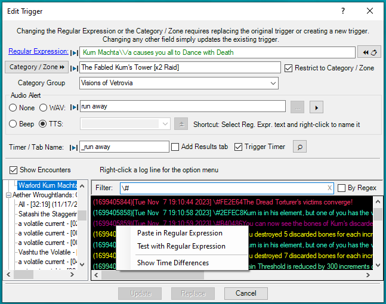
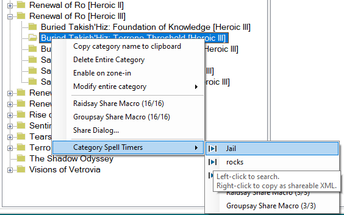

# Overview
This plugin organizes Custom Triggers into a panel of categories and a panel of triggers in the selected category. This is simply a different view of exactly the same triggers that are listed in the Custom Triggers tab.

Below is a screenshot of the panels.

Features that are similar to the Custom Triggers tab:
* Green is used to show active triggers. A green category indicates that the category contains active triggers.
* The checkbox next to the regular expression in the trigger pane enables / disables the trigger.
* Right-click context menus are available in the category and trigger panes.

Additional features of the plugin:
* When entering a zone in game, if there is a Category that matches the zone name, that Category is automatically selected.
* The __Find__ boxes at the top of the Category and Trigger panes provide incremental searches.

Version 1.2 Changes:
* Added the __current__ checkbox by the trigger __Find__ box to limit the find to the currently selected category.
* Added color code parsing of log lines in the [Show Encounters](#-show-encounters) list.
* Added the _Show Time Differences_ context menu for __Show Encounters__ log lines.
* Added starting an associated spell timer to the _Test with Regular Expression_ context menu for __Show Encounters__ log lines.
* Added indicators for fields that prevent saving to an EQII macro.
* Added writing multiple EQII macro files if there are more than 16 items.
* Added saving category spell timers to the macro when the Category _Raidsay Share Macro_ and _Groupsay Share Macro_ context menu is used.
* Added left-click and right-click options to the spell timers listed via the _Category Spell Timers_ context menu to search for or XML copy the spell timer, respectively.
* Moved the code to github.

## Editing Triggers
Trigger details are available by clicking the + next to the trigger.  A context menu is provided via a right-click on a trigger, as shown below.

Double-click the __Alert:__ or __Timer or Tab name__ to edit just those fields.

When there is a spell timer:
* A search for the spell timer in ACT's __Spell Timers (Options)__ window can be initiated via
	* double-clicking or right-clicking the __Trigger Timer__ line in the trigger pane,
	* pressing the __[Find]__ button in the __Timer or Tab name__ edit dialog,
	* or pressing the magnifying glass button next to the __Trigger Timer__ checkbox in the trigger edit dialog.
* The spell timer can be copied for sharing by right-clicking the __Timer or Tab name__ in the trigger pane and choosing the appropriate menu choice.

To edit all of the trigger fields, double-click the regular expression.

Features of the edit trigger dialog:
* If the Regular Expression or Category / Zone fields are changed, the dialog allows either replacing the original trigger or creating a new trigger.
* The paste clipboard button will recognize a log line copied from ACT's View Logs list and reformat the line to be a valid Regular Expression.
* While typing in the Regular Expression box, the text turns red if the expression is invalid.
* Selecting text in the Regular Expression and right-clicking provides a context menu that can replace the selection with a capture group.
* Capture groups in the Regular Expression are automatically added to the drop down list next to the TTS button (e,g, the 1 shown above which represents the __(\d+)__ in the expression). They may be inserted into the TTS expression via the insert button to the right of the drop down. Note that named capture groups such as `(?<player>\w+)` cannot be saved to an EQII macro due to the brackets.

### Show Encounters
The screenshot above also has the __Show Encounters__ checkbox checked.
* When the __Show Encounters__ checkbox is checked, the dialog expands to show a list of encounters on the left. Selecting an encounter displays a list of log lines for that encounter.
* To help find a potential trigger line, the log lines can be filtered by entering text in the __Filter:__ box.  Shown above is a filter of '#', which shows lines with a color code.
* The context menu for a log line allows the following:
	* Formatting it as a valid regular expression and pasting it into the __Regular Expression__ text box.
	* Testing it against the __Regular Expression__. When testing, any capture groups are appropriately replaced in a TTS expression and the spell timer (if set) is triggered.
	* Creating a spell timer from the time difference between matching log lines.

### Show Time Differences
The _Show Time Differences_ context menu assists in creating an ACT spell timer from non-damage log lines. The conceptual example below is the result of selecting _Show Time Differences_ given the filter `unleash a barrage`.

Pressing the __[Make Timer]__ button creates a spell timer using the data on the right hand side and opens ACT's __Spell Timers (Options)__ window with a search for that timer.

## Cateogry Pane
A right-click on a category brings up the category context menu as shown below:

The initial menu is self explantory or related to sharing data via EQII macros. Macros are disussed in the [EQII Macros](#-share-via-eqii-macros) section.

To build the _Category Spell Timers_ menu, the plugin searches for spell timers whose __Category__ or __Custom Tooltip__ matches the clicked category name.

To simply share a spell timer via copy/paste in chat, right click the spell timer name.

Left-click the spell timer name to open ACT's __Spell Timers (Options)__ window with a search for that timer name.

## Share via EQII Macros
Ideally, it would be possible to make a macro containing all of the zone's triggers and spell timers for sharing with the group (or raid) in a single step. Unfortunately this won't always work since macros won't handle certain characters and character sequences.

The trigger pane shows which triggers and spell timers can be shared via macro by displaying the 'macro play' icon next to the checkbox for the regular expression and timer name. In the Category screenshot above, all of the spell timers can go in a macro except ones that contain an apostrophe. Therefore those timers lack the 'macro play' icon.

When editing a trigger, the problem fields are indicated by the red circled 'macro play' button, as shown below:

It the case where the zone name contains an apostrophe, there's not much recourse. It can't be shared in a macro.

But in many cases, it is possible to work around the problem characters by changing the trigger. 

With macro-valid triggers or timers, a context menu selection of the _Raidsay Share Macro_ or _Groupsay Share Macro_ menu will create a macro to share all available and enabled triggers and spell timers. Then in an EQII chat window enter _/do_file_commands triggers.txt_ to share everything with the raid. Any invalid items are simply left out of the macro file.

EQII macros are limited to 16 lines. When sharing more than 16 items, multiple files are created. Items 1-16 are in file triggers.txt. Items 17-32 are in file triggers1.txt, etc.  The __Notifications__ tab in ACT lists which file(s) are used.

Macro issues are explained in more detail in the help for the plugin. Choose 'Help' from the trigger context menu.